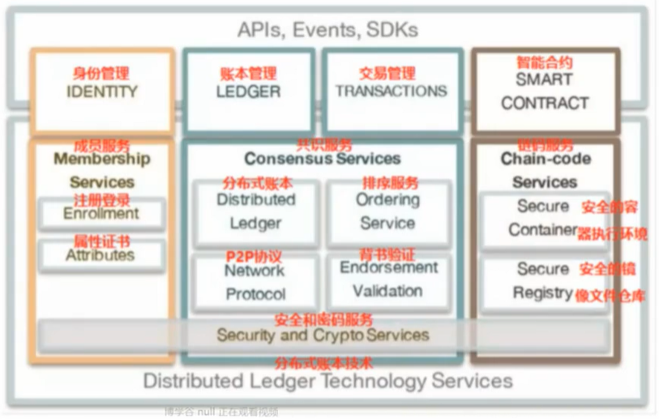
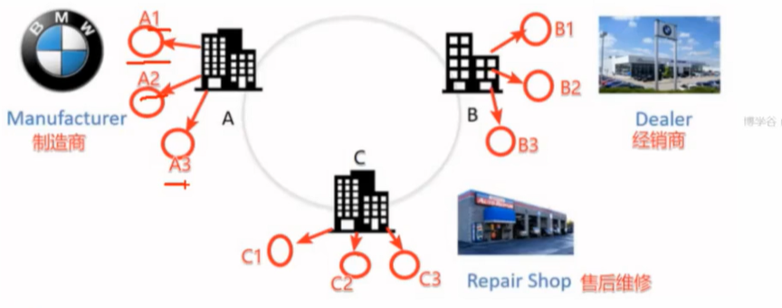
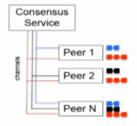
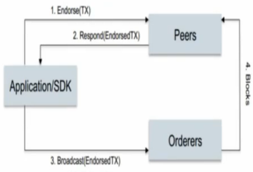
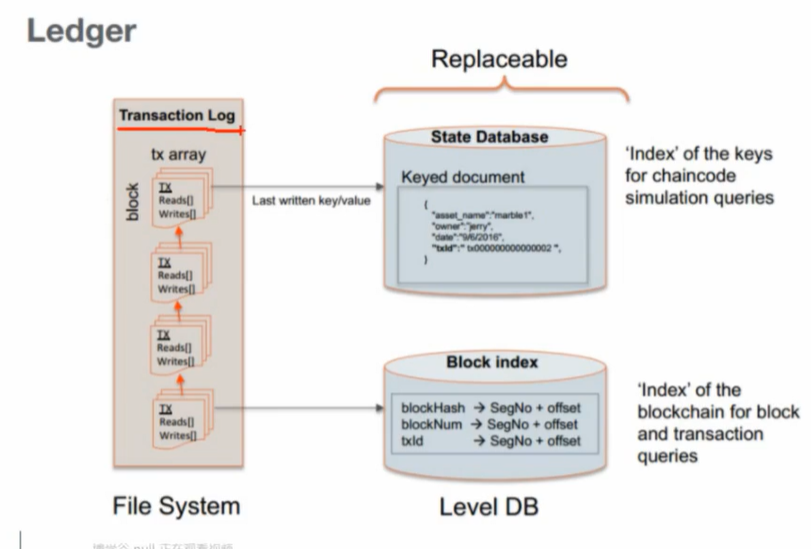

# Fabric入门

## 一、基本概念

### 1.1 逻辑架构



- **成员管理（MemberShip）**
  - 会员注册
    - 注册成功一个账号得到的不是用户名、密码
    - 使用==证书==作为身份认证的标志
  - 身份保护
  - 交易审计
  - 内容保密
    - 可以存在多条区块链，通过通道区分【通道类似QQ群，一个节点可以加入多条通道】
- **账本管理**
  - 区块链
    - 保存所有的交易记录
    - 没有矿工，只能设置多长时间生成区块
  - 世界状态
    - 数据的最新状态
    - 数据存储在当前节点的数据库中
      - 自带的默认数据库：levelDB，也可以使用couchdb
      - 键值对存储
- **交易管理**
  - 部署交易
    - 部署的是 ==链码== ，给节点安装链码 - chaincode - 智能合约
  - 调用交易
    - invoke
- **智能合约**
  - 一段代码，处理网络成员所同意的业务逻辑
  - 实现链码和账本的分离（逻辑和数据分离）

### 1.2 基础概念



- **组织**

  > 是指这样一个社会实体，具有明确的目标导向和精心设计的结构与有意识协调的活动系统，同时又同外部环境保持密切的联系。
  >
  > 在Fabric中一个组织里有什么？
  >
  > - 有用户
  > - 有进行数据处理的节点 -> peer
  >   - put -> 写数据到区块链
  >   - get -> 数据查询

- **节点(client、peer、orderer)**

  - client：进行交易管理（cli、node sdk，java sdk）
    - cli -> 通过linux的命令行对数据进行提交和查询
    - node.js ->  实现一个客户端
    - java -> 实现一个客户端
    - go也可以，实现服务端
  - peer：存储和同步账本数据
    - 用户通过客户端工具对数据进行put操作，将数据写入到一个节点
    - 数据同步是fabric框架实现的
  - orderer：排序和分发交易
    - 为什么要排序？
      - 解决双花问题
      - 每发起一次交易都会在orderer节点进行排序
    - 交易数据先打包，后写入区块

- **通道** -> channel

  > 通道是有共识服务（ordering）提供的一 种通讯机制，将peer和orderer连接在一起，形成一个具有保密性的通讯链路（虚拟），实现了业务隔离的要求；通道也与账本（ledger）状态（worldstate）紧密相关。
  >
  > Consensus Server: order节点
  >
  > - 一个peer节点可以同时加入到不同的通道中
  >
  > - peer节点每加入一个新的通道，存储数据的区块链就需要添加一条
  >
  > - 只要加入一个通道就可以获得这个通道中的数据
  >
  > - 每个通道对应一个区块链



- **交易流程**

  

  > 要完成交易，这笔交易必须要有背书策略！假设：
  >
  > - 组织A中的成员必须同意
  > - 组织B中的成员必须同意
  >
  > 1. Application/SDK：充当客户端角色
  >    -  写数据、查询数据
  > 2. Endorse（背书）：客户端发起一个提案，给到peer节点
  >    - 会发送给组织A和组织B中的节点
  > 3. peer节点将交易进行预演，得到一个结果
  > 4. peer节点将交易结果发送给客户端
  >
  >    - 如果模拟交易失败，交易终止
  >    - 成功，继续
  > 5. 客户端将交易提交给排序节点
  > 6. 排序节点对交易打包
  > 7. 排序节点将打包数据发送给peer节点，peer节点将数据写入区块
  >
  >    - 打包数据的发送不是实时的
  >    - 有设定条件，在配置文件中
  >
  > 背书策略：【=交易方案】
  >
  > - 要完成一笔交易，这笔交易的完成过程就是背书 

- **账本**

  

## 二、环境搭建


### 2.1 安装Docker

```shell
## ubuntu
# 安装docker
$ sudo apt-get install docker-ce -y
# 查看版本
$ docker version
# 添加用户到docker组
$ sudo gpasswd -a $USER docker

# 安装docker-compose
$ sudo apt-get install python-pip -y
$ sudo apt-get install docker-compose
# 查看版本
$ sudo docker-compose version

## centos安装docker
# 安装所需软件包
$ sudo yum install -y yum-utils device-mapper-persistent-data lvm2
# 加入阿里docker源
$ sudo yum-config-manager --add-repo http://mirrors.aliyun.com/docker-ce/linux/centos/docker-ce.repo
# 安装最新版本的Docker和containerd
$ sudo yum install docker-ce docker-ce-cli containerd.io
```

### 2.2 安装Go

```shell
# 安装包地址
https://golang.org/d1/	- 翻墙
https://studygolang.com/d1	- 国内

# 下载好后解压到/usr/local
# 配置环境变量
$ vim ~/.bashrc
	export GOROOT=/usr/local/go
	export GOPATH=$HOME/go
	export PATH=$PATH:$GOROOT/bin:$GOPATH/bin
$ source ~/.bashrc
# 查看版本
$ go version
```

### 2.3 Node安装

```shell
# 下载二进制文件
$ wget https://nodejs.org/dist/v8.11.4/node-v8.11.4-linux-x64.tar.xz
# 解压到/opt
$ tar xvf node-v8.11.4-linux-x64.tar.xz -C /opt
# 打开系统级别配置文件
$ vim /etc/profile
	export NODEJS_HOME=/opt/node-v8.11.4-linux-x64
    export PATH=$PATH:$NODEJS_HOME/bin
# 重新加载配置文件（该配置文件为系统级别，对所有用户生效）
$ . /etc/profile
# 查看版本
$ node -v
# npm换源
$ npm config set registry http://registry.npm.taobao.org/
```

### 2.4 部署Hyperledger Fabric

```shell
# 创建放置目录，使用curl下载脚本
$ mkdir Fabric
# 官网
$ curl -sSL http://bit.ly/2ysbOFE | bash -s <fabric version> <fabric-ca version> <thirdparty version>
	- fabric: fabric版本[目前最高版本2.3.1]
	- fabric-ca: fabric-ca版本[目前最高版本1.4.9]
	- thirdparty: 第三方库版本
# 国内
$ curl -sSL https://raw.githubusercontent.com/hyperledger/fabric/master/scripts/bootstrap.sh | bash -s 1.4.0 1.4.3 0.4.10
###
# 此链接会下载两个压缩包以及相关镜像文件
# hyperledger-fabric-ca-linux-amd64-<version>.tar.gz
# hyperledger-fabric-linux-amd64-<version>.tar.gz
###

# 将fabric-samples/bin 目录下内容拷贝到/usr/local/bin
$ cp fabric-samples/bin/* /usr/local/bin
```

### 2.5 跑通测试用例

```shell
# 进入测试用例文件夹，版本为1.2.0
$ cd fabric-samples/first-network
# 生成证书
$ ./byfn.sh generate
# 启动/关闭环境
$ ./byfn.sh up
$ ./byfn.sh down

# 进入测试用例文件夹，版本为2.2.2
$ cd fabric-samples/test-network
$ ./network.sh <Mode> [Flags]
Usage:
 up - Bring up Fabric orderer and peer nodes. No channel is created
 up createChannel - Bring up fabric network with one channel
 createChannel - Create and join a channel after the network is created
 deployCC - Deploy a chaincode to a channel (defaults to asset-transfer-basic)
 down - Bring down the network
```

## 三、Fabric介绍

### 3.1 Docker镜像文件

​	预留8G空间安装以下镜像

| 镜像文件                       | 用途                                                      |
| :----------------------------- | --------------------------------------------------------- |
| `hyperledger/fabric-peer`      | peer模块镜像文件【存储区块】                              |
| `hyperledger/fabric-orderer`   | orderer节点镜像文件【=矿工，负责数据打包】                |
| `hyperledger/fabric-ca`        | CA模块镜像文件【认证】                                    |
| `hyperledger/fabric-ccenv`     | Go语言chaincode运行环境库镜像文件                         |
| `hyperledger/fabric-tools`     | 相关工具镜像文件【cryptogen，configtxgen，order，peer等】 |
| `hyperledger/fabric-couchdb`   | couchdb数据库镜像文件                                     |
| `hyperledger/fabric-kafka`     | 与zookeeper一起用于排序                                   |
| `hyperledger/fabric-zookeeper` |                                                           |

### 3.2 工具介绍

​	确保在任意目录可以使用这些工具，添加到$PATH。

| /fabric-samples/bin目录下工具 | 用途 |
| ----------------------------- | ---- |
| `configtxgen`                 |      |
| `configtxlator`               |      |
| `cryptongen`                  |      |
| `discover`                    |      |
| `fabric-ca-client`            |      |
| `get-docker-images.sh`        |      |
| `idemixgen`                   |      |
| `orderer`                     |      |
| `peer`                        |      |

### 3.3 运行过程

1. 创建通道。
2. 通信节点加入到通道。
3. 准备编写好的链码，并安装到节点上。
4. 初始化，在一个节点上做一次即可。
5. 客户端发起一个交易请求 => 转账。
6. 交易成功后，数据发送给排序节点，打包数据。
7. 打包后的数据写入到区块。

## 四、核心模块

| 模块名称        | 功能                                         |
| --------------- | -------------------------------------------- |
| `peer`          | 主节点模块，负责存储区块链数据，维护链码     |
| `orderer`       | 交易打包，排序模块                           |
| `cryptogen`     | 组织和证书生成模块                           |
| `configtxgen`   | 区块和交易生成模块，生成创世块文件。通道文件 |
| `configtxlator` | 区块和交易解析模块，转义.block->.json        |

> 五个模块中`peer`和`orderer`属于系统模块，`cryptogen`、`configtxgen`、`configtxlator`属于工具模块。工具模块负责证书文件、区块链创始块、通道创始块等相关文件和证书的生成工作，但是工具模块不参与系统的运行。`peer`模块和`orderer`模块作为系统模块是Fabric的核心模块，启动之后会以守护进程的方式在系统后台长期运行。
>
> Fabric中的五个核心模块都是基于命令行的。

### 4.1 cryptogen

> 用于生成组织结构和账号相关的文件，任何Fabric系统的开发通常都是从`cryptogen`模块开始的。

```shell
$ cryptogen --help
usage: cryptogen [<flags>] <command> [<args> ...]
Utility for generating Hyperledger Fabric key material
Flags:
  --help  Show context-sensitive help (also try --help-long and --help-man).
Commands:
	# 显示帮助信息
	`help [<command>...]`
	# 根据配置文件生成证书信息
	`generate [<flags>]`
	# 显示系统默认的cryptogen模块配置文件信息
  	`showtemplate`
  	# 显示当前模块版本号
	`version`
	# 扩展现有网络
	`extend [<flags>]`
```

### 4.2 configtxgen

>用于创始块文件和通道文件生成。

```shell
$ configtxgen --help
Usage of configtxgen:
  # 指定所属的组织
  `-asOrg string`
  `-channelCreateTxBaseProfile string`
        Specifies a profile to consider as the orderer system channel current state to allow modification of non-application parameters during channel create tx generation. Only valid in conjunction with 'outputCreateChannelTx'.
  # 指定创建的channel的名字，含默认值
  `-channelID string`
  # 执行命令要加载的配置文件的路径，默认当前目录
  `-configPath string`
  # 打印指定区块文件中的配置内容，string: 区块文件名字
  `-inspectBlock string`
  # 打印创建通道的交易的配置文件
  `-inspectChannelCreateTx string`
  # 更新channel的配置信息
  `-outputAnchorPeersUpdate string`
  # 输出创始区块文件的路径和名字
  `-outputBlock string`
  # 输出通道文件路径
  `-outputCreateChannelTx string`
  # 将组织的定义打印为JSON（便于手动添加一个通道）
  `-printOrg string`
  # 指定配置文件中的节点
  `-profile string`
  # 版本
  `-version`
```

### 4.3 peer

#### 4.3.1 创建通道

```shell
$ peer channel create [flags]
	`-o, --orderer: orderer节点地址`
	`-c, --channelID: 要创建的通道ID，必须小写且小于250个字符`
	`-f, --file: 由configtxgen生成的通道文件，用于提交给orderer`
	`-t, --timeout: 创建通道的超时时长，默认为5s`
	`--tls: 通信时是否使用tls加密`
	`--cafile: 当前orderer节点pem格式的tls证书文件，需要使用绝对路径`
# orderer节点的pem格式的tls证书文件的路径参考:
crypto-config/ordererOrganizations/njtech.com/orderers/orderer.njtech.com/msp/tlscacerts/tlsca.njtech.com-cert.pem
# example
$ peer channel create -o orderer节点地址:端口 -c 通道名 -f 通道文件 --ordererTLSHostnameOverride orderer.njtech.com --tls true --cafile orderer节点pem格式的tls证书文件
	- orderer节点地址：可以是ip地址或者域名
	- orderer节点监听的端口是7050
```

#### 4.3.2 加入通道

```shell
$ peer channel join [flgs]
	`-b, --blockpath: 通过 peer channel create 命令生成的通道文件`

# example
$ peer channel join -b 生成的通道block文件
```

#### 4.3.3 更新锚节点

```shell
# 每个组织的锚节点只有1个
$ peer channel update [flgs], 常用参数:
	`-o, --orderer: orderer节点地址`
	`-c, --channelID: 通道名称`
	`-f, --file: 由 configtxgen 生成的组织锚节点文件，用于提交给orderer`
	`--tls:通信时是否使用tls加密`
	`--cafile: 当前orderer节点pem格式的tls证书文件，使用绝对路径`
$ peer channel update -o orderer节点地址:端口 -c 通道名 -f 锚节点更新文件 --tls --cafile orderer节点pem格式的证书文件
```

#### 4.3.4 安装链码

```shell
$ peer chaincode install [flgs], 常用参数:
	`-c, --ctor: JSON格式的构造参数，默认是"{}"`
	`-l, --lang: 链码语言, golang(默认),node,java`
	`-n, --name: 链码名字`
	`-p, --path: 链码的目录，从$GOPATH/src 路径后开始写`
	`-v, --version: 链码版本`
# example
$ peer chaincode install -n 链码名字 -v 链码版本 -l 链码语言 -p 链码位置
	- 链码名字自己起
	- 链码版本，自己更具实际情况指定
$ peer chaincode install -n testcc -v 1.0 -l node -p github.com/chaincode
```

#### 4.3.5 链码初始化

```shell
$ peer chaincode instantiate [flgs], 常用参数:
	`-C, --channelID: 通道名称`
	`-c, --ctor: JSON格式的构造参数，默认为"{}"`
	`-l, --lang: 链码语言, golang(默认),node,java`
	`-n, --name: 链码名字`
	`-P, --policy: 链码的背书策略`
	`-v, --version: 版本`
	`--tls: 通信是否加密`
	`--cafile: orderer节点pem格式的tls证书，使用绝对路径`

# example
# -c '{"Args":["init","a","100","b","200"]}'
# -P "AND ('Org1MSP.member','Org2MSP.member')"
# 在初始化时指定背书策略，则后续交易都要满足背书策略
$ peer chaincode instantiate -o orderer节点地址:端口 --tls --cafile orderer节点的pem证书文件 -C 通道名称 -n 链码名称 -l 链码语言 -v 链码版本 -c 链码Init函数调用 -P 背书策略
$ peer chaincode instantiate -o localhost:7050 --tls --cafile /root/test-network/organizations/ordererOrganizations/example.com/orderers/orderer.example.com/msp/tlscacerts/tlsca.example.com-cert.pem -C mychannel -n testcc -l node -v 1.0 -c '{"Args":["initLedger"]}' -P "AND ('Org1MSP.member','Org2MSP.member')"

# 2.0版本后改方法了？
$ peer chaincode invoke -o localhost:7050 --ordererTLSHostnameOverride orderer.example.com --tls --cafile /root/test-network/organizations/ordererOrganizations/example.com/orderers/orderer.example.com/msp/tlscacerts/tlsca.example.com-cert.pem -C mychannel -n testcc --peerAddresses localhost:7051 --tlsRootCertFiles /root/test-network/organizations/peerOrganizations/org1.example.com/peers/peer0.org1.example.com/tls/ca.crt --peerAddresses localhost:9051 --tlsRootCertFiles /root/test-network/organizations/peerOrganizations/org2.example.com/peers/peer0.org2.example.com/tls/ca.crt --isInit -c '{"function":"initLedger","Args":[]}'
```

#### 4.3.6 查询

```shell
$ peer chaincode query [flgs], 常用参数:
	`-n, --name: 链码名称`
	`-C, --channelID: 通道名称`
	`-c, --ctor: JSON格式的构造参数，默认为"{}"`
	`-x, --hex: 是否对结果进行编码处理`
	`-r, --raw: 是否输出二进制内容`
	`-t, --tid: 指定当前查询编号`
# example
# '{"Args":["query", "a"]}'
$ peer chaincode query -C 通道名称 -n 链码名称 -c 链码调用
```

#### 4.3.7 交易

```shell
$ peer chaincode invoke [flgs]，常用参数为
	`-o, --orderer: orderer节点地址`
	`-C, --channelID: 当前命令运行的通道`
	`-c, --ctor: JSON格式的构造参数，默认值为"{}"`
	`-n, --name: 链码的名字`
	`--tls: 通信时是否加密`
	`--cafile: 当前orderer节点pem格式的tls证书文件，使用绝对路径`
	`--peerAddresses: 指定要链接的peer节点的地址`
	`--tlsRootCertFile: 连接的peer节点的TLS根证书`
# 连接peer节点的TLS证书路径参考
/opt/gopath/src/github.com/hyperledger/fabric/peer/crypto/peerOrganations/orggo.njtech.com/peers/peer0.orggo.njtech.com/tls/ca.crt
# example
# -c '{"Args":["invoke", "a", "b", "10"]}'
$ peer chaincode invoke -o orderer节点地址:端口 --tls --cafile orderer节点pem格式的证书文件 -C 通道名称 -n 链码名称 --peerAddresses 背书节点1:端口 --tlsRootCertFiles 背书节点1的TLS根证书 --peerAddresses 背书节点2:端口 --tlsRootCertFiles 背书节点2的TLS根证书 -c 交易链码调用
```

## 五、Fabric账号

### 5.1 Fabric账号

> 1. 账号是什么？
>
>    账号是根据PKI规范生成的一组证书和密钥文件
>
> 2. 账号的作用？
>
>    - 保证记录在区块链中的数据不可逆，不可篡改
>    - Fabric中每条交易都会加上发起者的标签（签名证书），同时使用发起人的私钥进行加密
>    - 如果交易需要其他组织节点提供背书功能，那么背书节点也会在交易中加入自己的签名

```shell
# 节点msp目录结构
msp
|-- admincerts	# 对当前节点进行操作的证书
|-- cacerts		# CA证书
|-- keystore	# 密钥
|-- signcerts	# 签名证书
|-- tlscacerts	# 加密通信证书

# 组织msp目录结构
msp
|-- admincerts	# 对当前组织进行操作的证书
|-- cacerts		# CA证书
|-- tlscacerts	# 加密通信证书

# 用户msp目录结构
msp
|-- admincerts	# 对当前用户进行操作的证书
|-- cacerts		# CA证书
|-- keystore	# 密钥
|-- signcerts	# 签名证书
|-- tlscacerts	# 加密通信证书
```

> - msp 文件夹中内容
>   - admincerts：管理员证书
>   - cacerts：根CA服务器证书
>   - keystore：节点或者账号的私钥
>   - signcerts：符合x.509的节点或者用户证书文件
>   - tlscacerts：TLS根CA的证书
> - tls 文件夹中存放加密通信相关的证书文件

### 5.2 什么地方需要Fabric账号

- 启动 orderer

  > 启动 orderer 的时候需要通过环境变量或者配置文件给当前启动的 Orderer 设定相应的账号

  ```shell
  # 环境变量账号: -> 该路径为宿主机上的路径，非docker启动的orderer节点内部的挂载路径
  ORDERER_GENERAL_LOCALMSPDIR=./crypto-config/ordererOrganizations/njtech.com/orderers/orderer.njtech.com/msp
  # 账号目录结构
  msp
  ├─admincerts
  ├─cacerts
  ├─keystore
  ├─signcerts
  └─tlscacerts
  ```

- 启动 peer

  >启动 peer 的时候需要通过环境变量或者配置文件给当前启动的 peer 设定相应的账号

  ```shell
  # 环境变量账号: -> 该路径为宿主机上的路径，非docker启动的orderer节点内部的挂载路径
  CORE_PEER_MSPCONFIGPATH=./crypto-config/peerOrganizations/orggo.njtech.com/peers/peer0.orggo.njtech.com/msp
  ```

- 创建 channel

  > channel 是 fabric 中的重要组成部分，创建 channel 也是需要账号的

  ```shell
  # 环境变量账号: -> 该路径为宿主机上的路径，非docker启动的orderer节点内部的挂载路径
  # 在客户端中做的，客户端需要有一个用户的账号信息
  CORE_PEER_MSPCONFIGPATH=./crypto-config/peerOrganizations/orggo.njtech.com/users/Admin@orggo.njtech.com/msp
  ```

> 上边的内容我们可以发现，账号的内容是一样的，都包含5个不同的文件，但是还是有区别
>
> ```shell
> # Orderer 启动路径
> crypto-config/ordererOrganizations/njtech.com/orderers/orderer.njtech.com/msp
> # Peer 启动路径
> crypto-config/peerOrganizations/orggo.njtech.com/peers/peer0.orggo.njtech.com/msp
> # 创建 Channel 账号路径
> crypto-config/peerOrganizations/orggo.njtech.com/users/Admin@orggo.njtech.com/msp
> ```
>
> Peer 和  Orderer 都有属于自己的账号，创建 Channel 使用的是用户账户！

## 六、背书策略

> 区块链是一个去中心的，所有参与方集体维护的公共账本。Fabric 作为一个典型的区块链技术平台当然也具备这样的特点。Fabric中对数据参与方对数据的确认是通过 Chaincode 来进行的。
>
> 在 Fabric 中有一个非常重要的概念称为 Endorsement，中文名为背书。背书过程是一笔交易被确认的过程。而背书策略被用来指示对相关的参与方如何对交易进行确认。当一个节点收到另一个节点的交易请求的时候，会调用 VSCC（系统Chaincode，专门负责处理背书相关的操作）与交易的chaincode共同来验证交易的合法性。在 VSCC 和交易Chaincode共同对交易的确认中，通常会做以下的校验：
>
> - 所有背书是否有效（参与背书的签名是否有效）
> - 参与背书的数量是否满足要求
> - 所有背书参与方是否满足要求
>
> 背书策略是指定第二和第三点的一种方法。背书策略的设置只通过部署时 instantiate 命令中 -P 参数来设置的。
>
> ```shell
> "AND('Org1MSP.member', 'Org2MSP.member', 'Org3MSP.member')"
> "OR('Org1MSP.member', 'Org2MSP.member', 'Org3MSP.member')"
> "OR('Org1MSP.member', AND('Org2MSP.member', 'Org3MSP.member'))"
> ```
>
> 背书策略只针对写入操作，对于查询操作不背书。
>
> Fabric 中的背书发生在客户端，需要进行相关代码的编写才能完成整个背书操作。