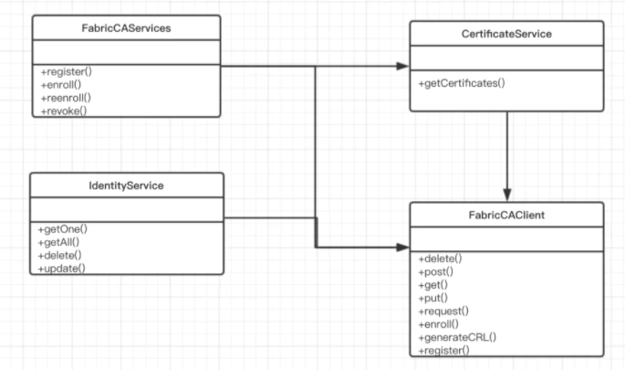
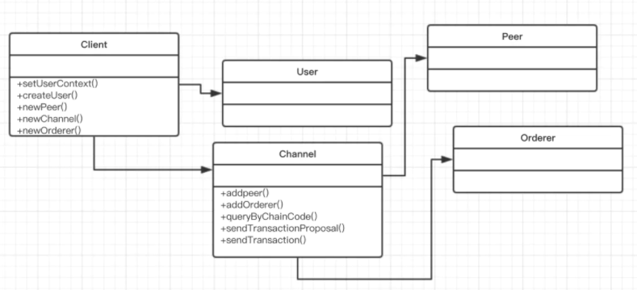
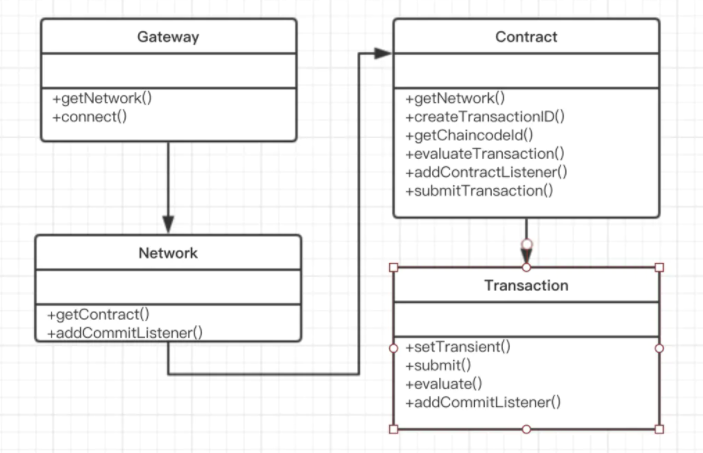

# Fabric-nodejs-SDK

## 一、package.json的基本配置

```json
"dependencies": {
    "fabric-ca-client": "^2.2.5",
    "fabric-client": "^1.4.17",
    "fabric-network": "^2.2.5",
    "grpc": "^1.24.3"
}
"dependencies": {
    "fabric-ca-client": "^2.2.5",
    "fabric-client": "^1.4.17",
    "fabric-network": "^2.2.5",
    "fs": "*",
    "grpc": "^1.24.3",
    "path": "^0.12.7",
    "pkcs11js": "^1.2.2"
}
```

## 二、fabric-ca-client

### 2.1 简介

> 与 fabric-ca 模块交互，负责证书管理，如：向 ca 节点申请证书



### 2.2 简单使用

- admin登录

  ```js
  // 创建ca
  let ca = new FabricCAServices('https://localhost:7054', tlsOptions , 'ca-org1', crypto_suite);
  // 登录
  let enrollment= await ca.enroll({enrollmentID: 'admin',enrollmentSecret: 'adminpw'})
  ```

- 注册用户并登录

  ```js
  // 创建ca
  let ca = new FabricCAServices('https://localhost:7054', tlsOptions , 'ca-org1', crypto_suite);
  // 注册用户
  let secret = awit fabric_ca_client.register({enrollmentID: 'user1', affiliation: 'org1.department1',role: 'client'}, admin_user);
  // 用户登录
  let enrollment = await fabric_ca_client.enroll({enrollmentID: 'user1', enrollmentSecret: secret});
  ```

## 三、fabric-client

### 3.1 简介

> 与 fabric 网络交互，发送提案、发送交易、监听区块等



### 3.2 简单使用

- 创建身份标识

  ```js
  let client = new Client
  let keyPem = fs.readFileSync('.msp/keystore/user-key.pem','utf-8')
  let certPem = fs.readFileSync('./msp/signcerts/user-cert.pem','utf-8')
  let user = await client.createUser({        //创建User对象
    username: 'user',                         //用户名称
    mspid: 'Org1MSP',                       //所属MSP的ID
    cryptoContent: {
      privateKeyPEM: keyPem,                  //用户私钥
      signedCertPEM: certPem                  //用户证书
    },
    skipPersistence: true                     //不计入缓存
  })
  client.setUserContext(user,true)            //设置为client的当前身份
  ```

- 创建通道对象，并添加peer与orderer

  ```js
  let channel = client.newChannel('mychannel')
  channel.addPeer(client.newPeer('grpc://127.0.0.1:7051'))
  channel.addOrderer(client.newOrderer('grpc://127.0.0.1:7050'))
  ```

- 发送invoke交易

  ```js
  // 构建请求参数
  let req = {
    chaincodeId: 'mycc',
    fcn: 'invoke',
    args: ['10'],
    txId: client.newTransactionID() // 创建交易id
  }
  // 获取背书
  let prsp = await channel.sendTransactionProposal(req) 
  // 提交交易
  let rsp = await channel.sendTransaction({
    proposalResponses: prsp[0],
    proposal: prsp[1]
  })
  ```

## 四、fabric-network

### 4.1 简介

> 与 fabric 网络交互，发送交易、监听区块等，是对fabric-client的集成，使用场景偏向普通业务直接集成。



### 4.2 简单使用

- 创建 wallet （存放身份标识）

  ```js
  const wallet = new FileSystemWallet(walletPath);
  ```

- 创建Gateway，并连接 fabric 网络

  ```js
  const gateway = new Gateway();
  // 启用了发现服务
  await gateway.connect(ccpPath, 
                        {wallet, 
                         identity: 'user1',
                         discovery: { enabled: true, asLocalhost: false }
                        }
  );
  ```

- 获取智能合约部署的 channel 网络

  ```js
  const network = await gateway.getNetwork('mychannel');
  ```

- 获取智能合约对象

  ```js
  const contract = network.getContract('fabcar');
  ```

- 发送 invoke 交易

  ```js
   await contract.submitTransaction('changeCarOwner', 'CAR10', 'Honda')
  ```

- 发送 privateData 交易

  ```js
  const result = await contract.createTransaction(transactionName).setTransient(privateData).submit(arg1, arg2);
  ```

  