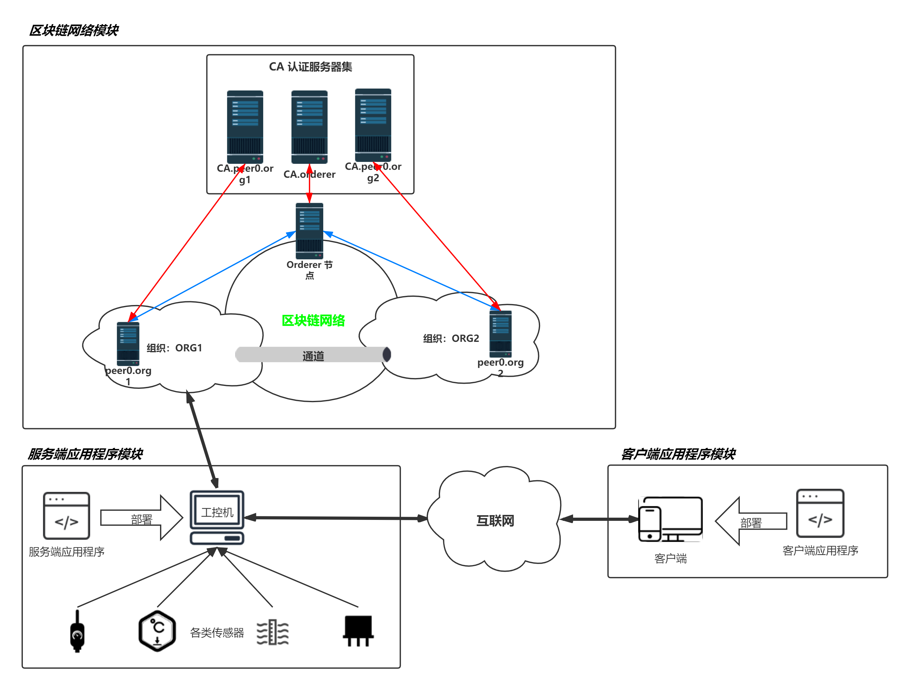

# Fabric.IoTAUT
> 基于区块链的物联网认证系统，使用Hyperledger Fabric 2.0 框架，实现区块链网络环境、服务器和客户端应用程序。

##  系统设计

本系统主要包括如下三大子模块：

1）区块链网络模块（iot-network）：模块主要实现区块链网络相关资产的部署和管理。资产包括节点、通道和智能合约等。并且此模块将向外部提供必要的接口，以用于访问、管理区块链网络中的资产。

2）服务端应用程序模块（iot-server）：此模块主要实现区块链网络操作接口的封装，并向服务请求者（如物联网设备、用户）提供相应的 API ，主要包括：实体注册、实体登录，区块数据存储、区块数据查询、区块链查询、节点信息查询等接口。

3）客户端应用程序模块（iot-client）：此模块主要实现可供用户直接操作本系统的可视化界面，使得用户可以模拟物联网设备接入区块链并操作区块链中资产。

系统的整体架构如下图所示：

## 使用流程

0. 请将`./iot-netwok/bin.zip`解压。

1. 在`Fabric教程`文件夹中有网络部署的一些文档，具体的步骤之后再整理。